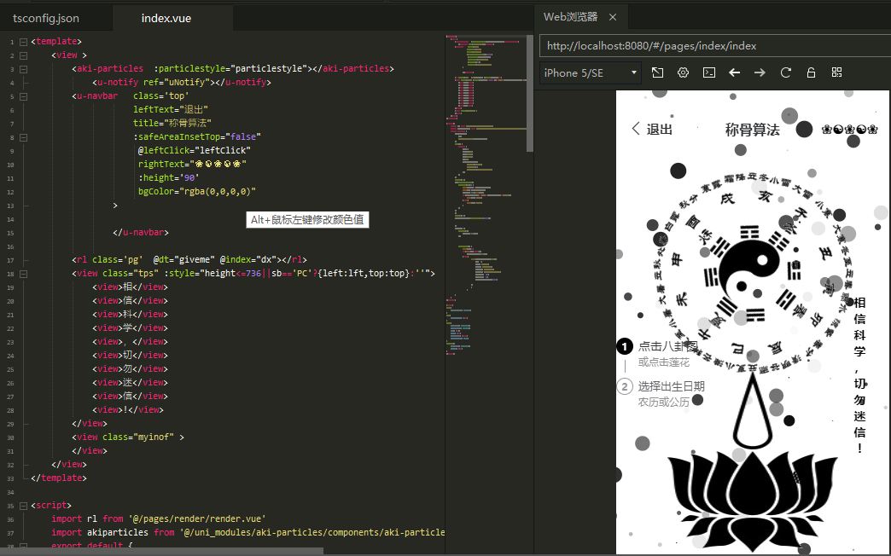
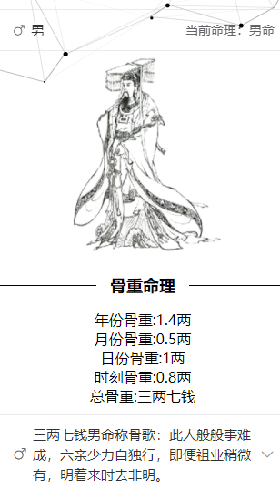

# UniApp-称骨算法（又名：称骨算命）

**注意：**作者[tmd404](github.com/tmd404)并不迷信啊，所有项目算法实施均源自[百度](www.baidu.com)

## 编写目的：

**身边许多认识的中老年人都比较迷信，每次都在迷信途中被骗取了不少钱财，鉴于此尝试用所学的web知识编写一款免费供身边迷信人群使用的App/微信小程序，虽然没有什么技术含量，不过，也受到不少身边人的好评，也算是服务身边人吧。**

## 称骨算命简介：

**称骨算命是算命方法的一种，和 生辰八字 算命、 紫微斗数 算命异曲同工，略有不同，虽然都是用出生的时间算命，但比较而言，称骨算命将命运分的比较粗略，只是把命运分为五十一种。**

**中文名:** 称骨算命

**作者:** 袁天罡

**外文名:** Said bone Fortune-telling

**属性:** 一种算命方法

**年代:** 唐代

## 主要组件：

**布局方面没有考虑太多，感觉在此处element-ui适配性不及uview-ui，因此，主要采用uview-ui组件实现的项目布局交互。**

## 部分运行效果：

### 1.部分代码和主界面：

### 2.日期选择：

### 3.确认时间：

### 4.骨重命理界面（男）：

### 5.骨重命理界面（女.图1）：

### 5.骨重命理界面（女.图2）：

### 初步展示完毕：

#### 1.个人主页：https://github.com/tmd404

#### 2.博客地址：https://tmd404.github.io/

#### 3.感谢大家的关注，初来乍到，如有不足敬请谅解，如果可以送上一个免费的Start吧！